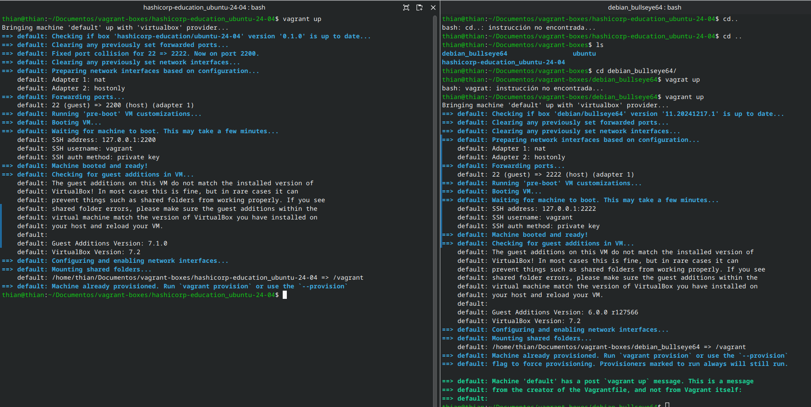
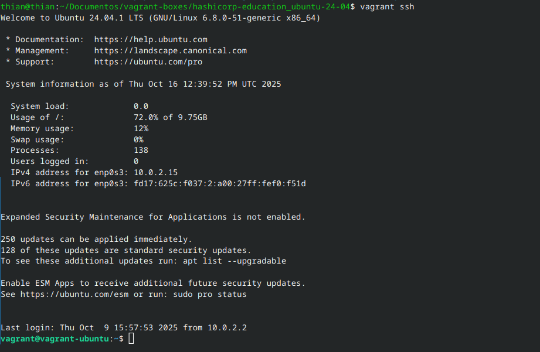
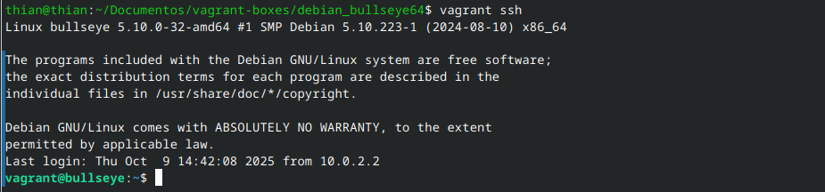
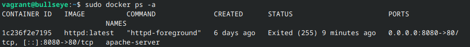
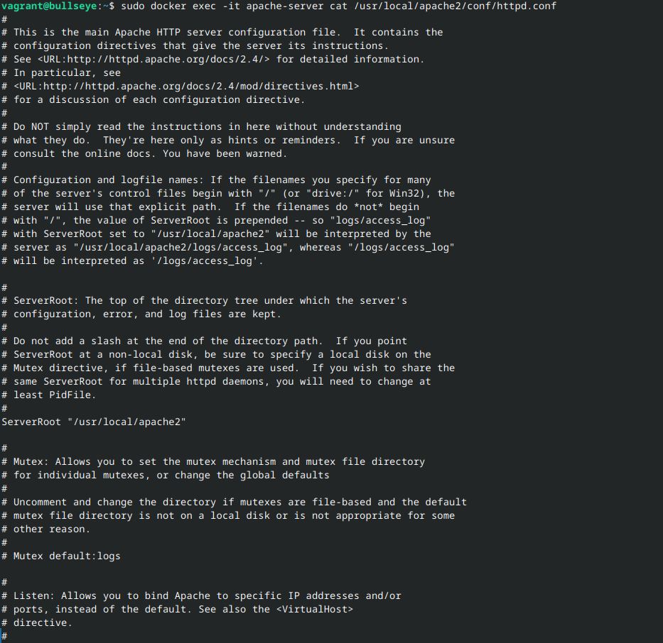
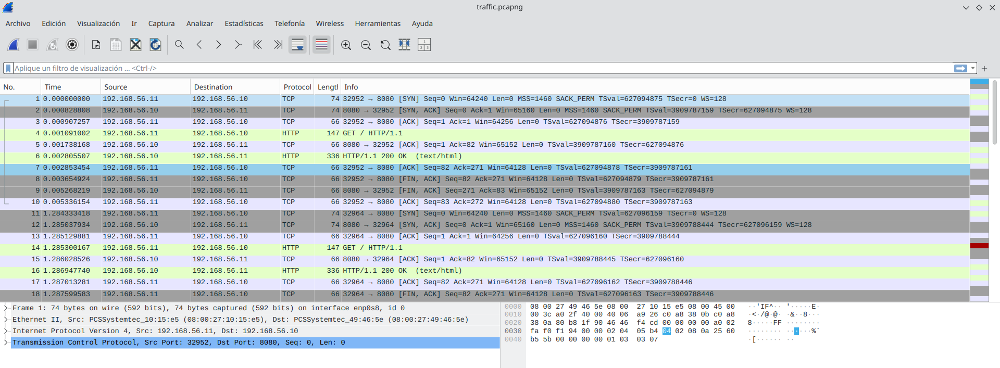

# vm_conections

Este proyecto aprovecha las facilidades de Vagrant para crear, configurar y gestionar máquinas virtuales de forma sencilla y reproducible. Vagrant permite definir entornos completos mediante archivos de configuración, automatizando la provisión de software y la red, lo que facilita la realización de pruebas, el desarrollo y el análisis de conectividad entre sistemas sin complicaciones manuales. Además, Vagrant garantiza que los entornos sean consistentes y fácilmente replicables en diferentes equipos.

Repositorio para la creación y configuración de entornos virtuales con Vagrant, orientados a pruebas de conectividad y análisis de tráfico de red.

## Objetivo del proyecto

Se configuraron dos máquinas virtuales, una con Ubuntu y otra con Debian, conectadas en una red privada para que pudieran comunicarse entre sí. El objetivo era que desde la VM Ubuntu, utilizando Wireshark, se pudieran capturar las peticiones y el tráfico generado por el servidor que estaba corriendo en la VM Debian. Así, se facilitó el análisis de la comunicación y el comportamiento de los servicios entre ambas máquinas en un entorno controlado.

## Contenido

- `Vagrantfile-Ubuntu`: Configuración de una VM Ubuntu 24.04 con Docker y Docker Compose.
- `Vagrantfile-Debian`: Configuración de una VM Debian Bullseye con Docker y Docker Compose.
- `ssh_config`: Configuración personalizada para conexiones SSH a las VMs.
- `traffic.pcapng`: Archivo de captura de tráfico de red (Wireshark).
- `httpd.conf`: Archivo de configuración principal de Apache extraído del contenedor Docker en la VM Debian. Se encuentra en el directorio raíz del proyecto tras su extracción.

## Requisitos

- Vagrant
- VirtualBox
- Docker y Docker Compose (se instalan automáticamente en las VMs)
- Wireshark (para analizar el archivo de tráfico)

## Uso

1. Clona el repositorio.
2. Inicia la VM deseada:
   - Para Ubuntu:  
     `vagrant up --provider=virtualbox --vagrantfile=Vagrantfile-Ubuntu`
   - Para Debian:  
     `vagrant up --provider=virtualbox --vagrantfile=Vagrantfile-Debian`

   Ejemplo de la terminal al levantar una VM con Vagrant:
   
   

3. Conéctate por SSH usando la configuración de `ssh_config`.

   Conectarse directamente por SSH a la VM permite acceder al sistema operativo invitado de forma segura y eficiente, facilitando la administración, la ejecución de comandos y la transferencia de archivos sin depender de la máquina anfitriona. Además, esta conexión directa es esencial para realizar pruebas, configuraciones y análisis de red en un entorno aislado y controlado.

   Ejemplo de la terminal al conectarse por SSH a la VM Ubuntu:
   
   

   Ejemplo de la terminal al conectarse por SSH a la VM Debian:
   
   

4. Analiza el tráfico con Wireshark usando el archivo `traffic.pcapng`.

5. Levanta un servidor Apache en la VM Debian usando Docker para simular tráfico y realizar pruebas de conectividad.

   Esta acción permite desplegar rápidamente un servidor web en la VM Debian, facilitando la generación de tráfico HTTP que puede ser capturado y analizado desde la VM Ubuntu. Es útil para comprobar la comunicación entre ambas máquinas y validar la configuración de red y servicios.

   Ejemplo de la terminal al levantar el servidor Apache con Docker:
   
   

6. Configura Apache para que escuche en el puerto 8080, permitiendo así la comunicación entre las VMs a través de este puerto.
   
   

## Notas

- Las VMs se configuran con red privada y recursos personalizados.
- El archivo de tráfico debe analizarse localmente con Wireshark o herramientas de consola como `tshark`.

## Captura de tráfico

Captura realizada con Wireshark desde la VM Ubuntu, analizando el tráfico generado por el servidor en la VM Debian:

